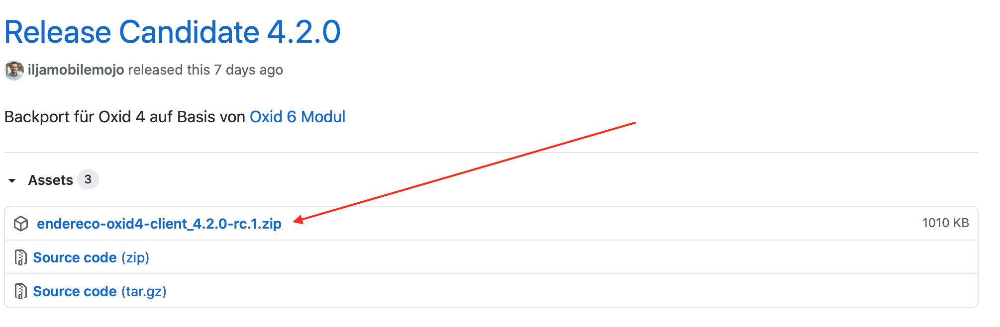
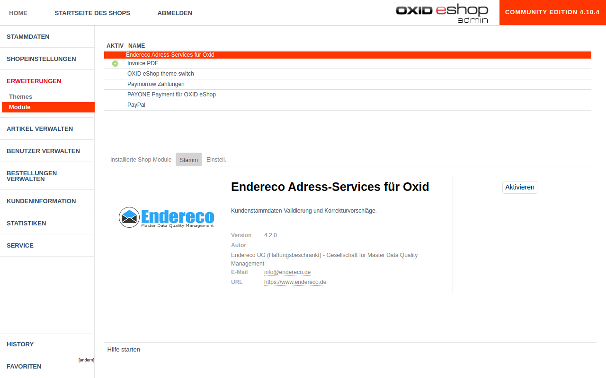

# Endereco Adressservices Integration für Oxid 4

Das Projekt ist ein Backport der Integration für Oxid 6 Onlinehsopsysteme, die man [hier](https://github.com/Endereco/endereco-oxid6-client) findet.

Die Lösung enthält alle Funktionen des ursprünglichen Modul mit Oxid 4 spezifischen Anpassungen: 

- keine Namespaces
- ISO-8859-1 Zeichenkodierung wird unterstützt
- metadata.php der 1.1 Version

## Funktionsbeschreibung

Das Endereco Services Modul ermöglichen auf einfache und unkomplizierte Weise, die Qualität der Adressdaten, die von Ihren Kunden eingegeben werden, zu verbessern. Hierfür wird ein 2 stufiger Prozess in die Adressformulare integriert, der eine korrekte Erfassung der Daten über nahezu alle Eingabegeräte sicherstellt.

Eine ausführliche Beschreibung ist [hier](https://www.endereco.de/hilfe/intallationsanleitung_oxid4/#funktionsbeschreibung_oxid6) zu finden.

## Installation

Um das Modul in einem Onlineshop zu installieren, muss zuerst der Quellcode heruntergeladen werden. 
Hierfür steht die [Auflistung der Releases](https://github.com/Endereco/endereco-oxid4-client/releases) zur Verfügung.

Jeder Release enthält eine herunterladbare Datei, einen ZIP Archiv, die alle notwendige Dateien des Moduls enthält.

Alternativ kann man gewünschte Version über `git clone` herunterziehen. 

Falls man vor der Installation noch irgendwelche Anpassungen an JS Logik des Moduls machen möchte, soll der npm-Buildskript ausgeführt werden: `npm install && npm run build`. Im Normallfall ist dies jedoch nicht notwendig.

Dieser heruntergeladene Quellcode muss als nächstes im Shop hinterlegt werden. 
Dafür erstelle dieses Verzeichnis `<Shophauptverzeichnis>/modules/endereco-oxid4-client` und speichere den heruntergeladene Quellcode in diesem.

D.h. der ganze Pfad zu `metadata.php` wäre zum Beispiel `<Shophauptverzeichnis>/modules/endereco-oxid4-client/metadata.php`

Ist dies gemacht, soll das Modul in der Auflistung der Module im Backend von Onlineshop sichtbar sein. Modul ist somit installiert.

## Aktivierung des Moduls

Zur Aktivierung des Moduls ist ein API-Key bei Endereco notwendig. Dieser kann über "30 Tage Kostenlos Testen" auf der [Website von Endereco](](https://www.endereco.de/oxid-eshop/) angefragt werden.

Trägt man den API-Key in Einstellungen des Modus ein und klickt auf "Aktivieren", ist das Modul einsatzbereit.

## Konfiguration des Moduls aus dem Backend

Die Konfigurationsmöglichkeiten des Moduls sind [hier](https://www.endereco.de/hilfe/intallationsanleitung_oxid6/) beschrieben.

Bei Problemen und technischen Rückfragen stehen wir unter support@endereco.de zur Verfügung.
