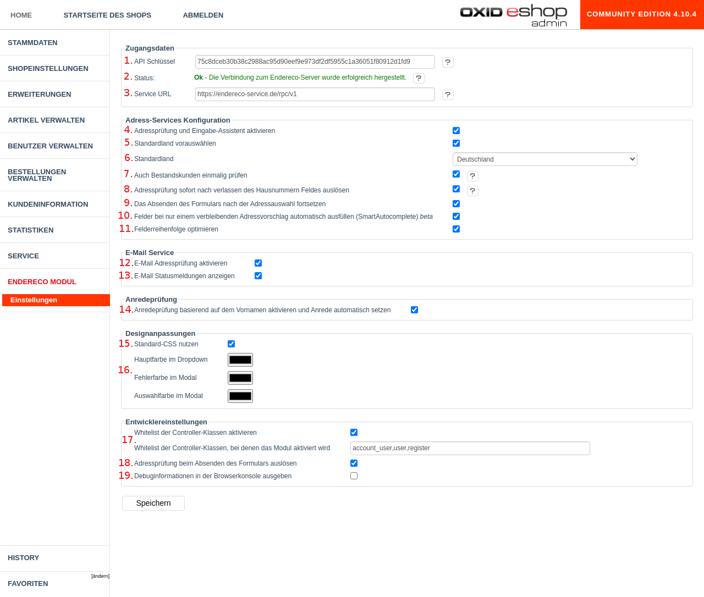

# Endereco Adressservices Integration für Oxid 4

Dieser Projekt ist ein Backport der Integration für Oxid 6 Onlinehsopsysteme, die man [hier](https://github.com/Endereco/endereco-oxid6-client) findet.

Die Lösung enthält alle Funktionen des ursprünglichen Modul mit Oxid 4 spezifischen Anpassungen: 

- keine Namespaces
- ISO-8859-1 Zeichenkodierung wird unterstützt
- metadata.php der 1.1 Version

## Installation

Um das Modul in einem onlineshop zu installieren, muss zuerst der Quellcode heruntergeladen werden. 
Hierfür steht die [Auflistung der Releases](https://github.com/Endereco/endereco-oxid4-client/releases) zur Verfügung.

Jeder Release enthält eine herunterladbare Datei, einen ZIP Archiv, die alle notwendige Dateien des Moduls enthält.

Alternativ kann man gewünschte Version über `git clone` herunterziehen. 

Falls man vor der Installation noch irgendwelche Anpassungen an JS Logik des Moduls machen möchte, soll der npm-Buildskript ausgeführt werden: `npm install && npm run build`. Im Normallfall ist dies jedoch nicht notwendig.

Nachdem man den Quellcode der Datei heruntergeladen hat, soll der Archiv entpackt werden 
(falls als Archiv heruntergeladen) und der ganze Quellcode im Onlineshop im Verzeichnis abgelegt werden:

`%SHOP_ROOT%/modules/endereco-oxid4-client`

D.h. der ganze Pfad zu `metadata.php` wäre zum Beispiel `%SHOP_ROOT/modules/endereco-oxid4-client/metadata.php`

Ist dies gemacht, soll das Modul in der Auflistung der Module im Backend von Onlineshop sichtbar sein. Modul ist somit installiert.

## Aktivation des Moduls

Vor der Aktivation ist es empfehlenswert einen API-Key bei Endereco anzufragen. Dafür kann man entweder über [die Website von Endereco](https://www.endereco.de/) eine Anfrage erstellen oder direkt beim robert@endereco.de per E-Mail anfragen.

Trägt man den API-Key in Einstellungen ein und klickt auf "Aktivieren", ist das Modul sofort aktiviert und einsatzbereit.

Es ist jedoch empfehlenswert sich die Einstellungen nochmal genauer anzuschauen und Feature zu aktivieren/deaktivieren, die man braucht.

## Konfiguration des Moduls aus dem Backend

Das Modul kann sowohl über die Settings-Seite in Modul Verwaltung, als auch über eine eigene Settings-Seite konfiguriert werden. Im folgenden beschreiben wir die eigene Settings Seite.

Endereco Modul wird mit einer Standardkonfiguration ausgeliefert, daher ist es nicht notwendig diese anzupassen. Lediglich der API-Key muss bereitgestellt werden.

1. **API-Schlüßel**: über diesen Schlüßel identifizieren wir Anfragen aus dem Shop in unserer Schnittstelle. Jeder Nutzer hat einen eigenen Schlüßel.
2. **Status der Verbindung**: Wenn die Server von Endereco erreichbar sind und der API Schlüßel korrekt ist, dann erscheint hier eine grüne Meldung. Sonst eine rote.
3. **Service URL**: URL des Servers, an den die Anfragen gehen. Dieses Feld ist vorkonfiguriert und muss nicht angepasst werden, aber manchmal können wir eien NUtzer bitten dort einen anderen Server einzutragen.
4. **Aktivation von Adressdiensten**: falls man Adressen in echtzeit prüfen lassen möchte, soll diese Einstellung aktiv bleiben. Sie aktivieret Adressvervollständigung und Addresskorrekturmodal.
5. **Standardland voruswählen**: bei manchen Eingabemasken ist das Zielland oft nicht ausgewählt. Diese Einstellung erkennt ein nicht ausgewähltes Land und füllt es voraus. Das erhöht die Qualität der Eingabe.
6. **Standard**: hier wird eingestellt, welches Land vorausgewählt werden muss. Id.r. Deutschland, kann aber auch ein anderes sein.
7. **Bestandskunden prüfen** Wenn Bestandskunden bestellen, müssen sie in der Regel ihre Adresse nicht mehr eingeben. Somit können wir sie auch nicht prüfen. Mit dieser Einstellung werden ihre Adresse zum Zeitpunkt des Login einmalig geprüft. Später im Checkout bekommen sie einen Korrekturvorschlag, falls die Adrese Fehler enthält.
8. **Addressprüfung nach dem Verlassen des Hausnummer Felder auslösen** Mit dieser Einstellung wird es konfiguriert, wann die Adresse von unserem Modul geprüft wird. Ist die Einstellung aktiv, so wird sie geprüft sobald der Nutzer die Adresse eingegeben hat und in ein Nicht-Adress-Feld geht (i.d.R verlässt er dabei Hausnummerfeld). Das ist eine UX Einstellung, die eine sofortige Korrektur ermöglicht, während der Kunde noch gedanklich bei der Adresse ist.
9. **Absenden des Formulars nach der Adressauswahl fortsetzen** Wird die Adresse beim Spiechern oder klicken auf "Weiter" geprüft, so beschließt diese Einstellung ob der Kunde nach der Korrektur auf der gleichen Seite belibt oder ob das Absenden mittels JavaScript automatisch nochmal geschieht. Diese Einstellung ist interessant, wenn man noch weitere Prüfungen in der Eingabemaske hat oder man eine eigene Absendelogik implementiert hat.
10. **SmartAutocomplete**: Füllt Felder während der Eingabe voraus, wenn die Eingabe eindeutig vorhergesagt werden kann.
11. **Felderreihenfolge optimieren**: Ändert die Eingabereihenfolge der Adresse so: Land -> Postleitzahl -> Ort -> Straße -> Hausnummer -> Adresszusatz. Diese Reihenfolge ermöglicht relevantere Addressvorschläge während der Eingabe.
12. **E-Mail Prüfung aktivieren**: Bestimmt, ob Emails auf Zustellbarkeit und Syntax geprüft werden sollen.
13. **Statusmeldungen für E-Mail**: Bestimmt, ob gefundene Fehler unter der E-Mail Eingabe als Text angezeigt werden sollen.
14. **Anredeprüfung**: Bestimmt, ob Andere geprüft soll. Wenn die Anrede zum Vornamen nicht passt, dann wird sie orange markiert. Falls keine Anrede ausgewählt ist, aber der Vorname eingegeben ist, dann wir Anrede automatisch ausgewählt (nur wenn eindeutig aus dem Vornamen erkennbar)
15. **Standard CSS nutzen**: Endereco Modul stellt für das Shopsystem optimierte Styles bereit. Falls man jedoch selber alles gestalten möchte, kann man diese Styles hire deaktivieren.
16. **Farben**: einfache Farbeneinstellungen für das Korrekturmodal.
17. **Whitelist für controller**: Erweiterte Einstellung. Im Normalfall baut sich Endereco Modul auf jeder seite, ausser der 404-Seite ein. Über diese Einstellung kann man das Endereco Modul nur auf bestimmten Seiten erlauben. Hilft bei Modul kollisionen und um PErformance zu optimieren.
18. **Adressprüfung beim Absenden des Formulars**: Löst die Adressprüfung, wenn man auf "Enter" oder Submit-Button klickt. Falls man eine eigene Logik dafür nutzt, kann man es hier deaktivieren.
19. **Debug Infos**: erlaubt dem JS-Client debuginfos in der Browser-Console auszugeben. Ist manchmal hilfreich, um ein Problem zu analysieren.

